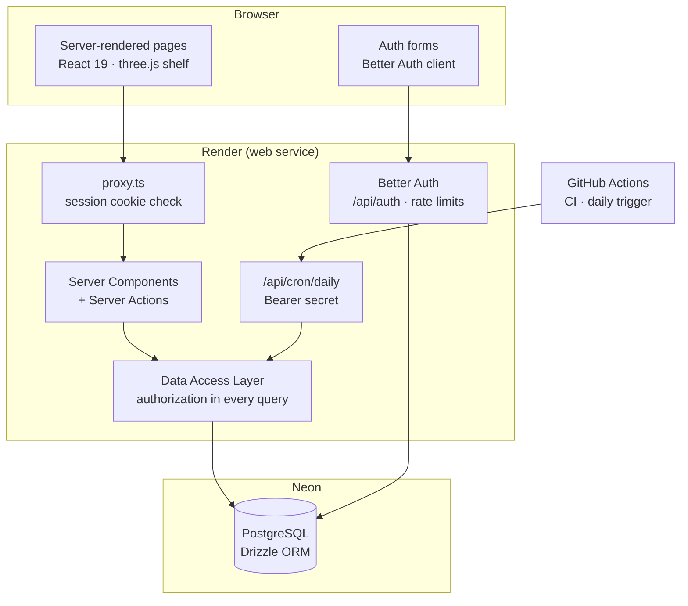

# 📚 Okoumé


> A textbook exchange platform for the Gabonese students' association in Montréal. Members sell or lend their course books for the semester, reserve each other's, and meet on campus. Every book sits on a 3D bookshelf, sorted by section like in a library.

**Live demo:** [okoume.onrender.com](https://okoume.onrender.com) (French interface)

---

## ✨ Features

- **3D bookshelf** (three.js) showing every available book, with a plain list fallback when WebGL or motion is unavailable
- **Accounts**: sign-up, email confirmation, sign-in, password reset and change, sign out of all devices, data export, account deletion
- **Member approval**: new accounts are validated by the association's committee before they can publish or reserve
- **Listings**: publish, edit, withdraw; sell (with a price) or lend for the semester (with a return date)
- **Reservations**: request, accept or decline, hand over, return. Exactly one active reservation per book, enforced by the database
- **Committee dashboard**: approve or suspend members, remove listings, audit log of every decision
- **Emails**: every email is written to an outbox table first, then sent through Resend when an API key is configured
- **Daily job**: loan reminders 3 days before the due date, cleanup of expired sessions, tokens and unconfirmed sign-ups
- **Privacy** (Québec Law 25): privacy policy, retention periods, data export and deletion from the account page

### Try it

Create an account on the live demo. In demo mode, emails are not sent: they appear in a public demo inbox, and new accounts are approved automatically so you can publish and reserve right away.

---

## 🏗️ Architecture



**Design choices**

- **Authorization lives in the data layer.** Every read and write goes through a `server-only` module that checks the viewer's role and puts the ownership condition in the SQL `WHERE` clause. Pages and actions never query the database directly.
- **DTOs, not rows.** Data returned to pages is built field by field, so a seller's full name or ID can never leak to the client by accident.
- **State transitions are conditional updates** (`UPDATE … WHERE status = 'requested'`). A double click or two users acting at once cannot move a reservation into an invalid state.
- **Email outbox.** Emails are stored before sending, so nothing is lost if the provider is down, and the app runs without any email service.

---

## 🗄️ Database Schema

```
user ─┬── session, account            (Better Auth)
      │
      ├── listing        (seller_id → user)
      │      section, course_code, title, edition, condition,
      │      kind sale|loan, price_cents, status available|reserved|lent|closed|removed
      │
      ├── reservation    (listing_id → listing, buyer_id → user)
      │      status requested|accepted|declined|cancelled|handed|returned|completed,
      │      due_date (loans)
      │      UNIQUE (listing_id) WHERE status IN ('requested','accepted','handed')
      │
      ├── email_outbox   (user_id → user)
      └── audit_log      (actor_id → user)
```

Check constraints enforce price rules (a loan has no price, a sale costs 0 to 1000 $), field lengths and colour formats. Migrations are plain SQL generated by Drizzle Kit.

---

## 🧪 Tests

**49 integration tests** run the real data layer against a real PostgreSQL database. Only the session lookup is faked.

They cover:

- every cell of the permission table (visitor, pending member, member, owner, committee)
- what a listing page reveals depending on who is looking
- every reservation transition, including invalid ones
- two users reserving the same book at the same moment
- limits (20 active listings, 10 reservation requests per day)
- suspension side effects (sessions revoked, listings removed, requests cancelled)
- the daily job (one reminder per loan, purge of unconfirmed accounts)
- input validation and redirect safety

```bash
npm test
```

---

## 🔬 CI/CD Pipeline

On every push and pull request, GitHub Actions starts a PostgreSQL service and runs:

1. **TypeScript**: strict type checking
2. **ESLint**: static analysis
3. **Vitest**: integration tests against PostgreSQL
4. **Migrations**: applied to a fresh database
5. **Next.js build**: production build

Render deploys `main` automatically and applies migrations during the build.

---

## 🔐 Security

- Passwords of **15 characters minimum** (OWASP ASVS 5), hashed by Better Auth
- **Rate limits** on sign-in, sign-up, password reset and verification emails, stored in PostgreSQL
- Sessions **revoked** on password change, password reset and member suspension
- **No account enumeration**: sign-up and password reset give the same answer whether the address exists or not
- **Content Security Policy**, HSTS, `X-Frame-Options`, `Referrer-Policy`, `Permissions-Policy`
- Environment variables **validated with Zod** at startup
- Cron endpoint protected by a bearer secret compared in constant time
- Public demo inbox never shows password-reset links

---

## 🗂️ Project Structure

```
Okoume/
├── src/
│   ├── app/                  # Routes (App Router): shelf, listings, account, committee, legal pages
│   ├── components/           # UI components, 3D shelf engine, forms
│   ├── lib/                  # Validation (Zod), env, formatting helpers
│   ├── server/
│   │   ├── dal/              # Data access layer: listings, reservations, admin, account
│   │   ├── actions/          # Server Actions (validate → DAL → message)
│   │   ├── db/               # Drizzle schema and client
│   │   ├── auth.ts           # Better Auth configuration
│   │   ├── email.ts          # Outbox + Resend
│   │   └── jobs.ts           # Daily job
│   └── proxy.ts              # Redirects signed-out visitors away from private pages
├── test/                     # Integration tests (Vitest + PostgreSQL)
├── drizzle/                  # SQL migrations
├── scripts/                  # migrate, seed
├── .github/workflows/        # CI + daily job trigger
└── render.yaml               # Render blueprint
```

---

## 🌐 Tech Stack

| Layer | Technology |
|---|---|
| Framework | Next.js 16 (App Router, Server Components, Server Actions) |
| UI | React 19, CSS, three.js |
| Language | TypeScript |
| Database | PostgreSQL (Neon), Drizzle ORM |
| Auth | Better Auth (email and password, roles) |
| Validation | Zod |
| Email | Resend (optional), outbox table |
| Testing | Vitest |
| CI | GitHub Actions |
| Hosting | Render |

---

## 🚀 Run Locally

Requires Node 22 and PostgreSQL 16.

```bash
npm install
cp .env.example .env        # fill in DATABASE_URL and BETTER_AUTH_SECRET
npm run db:migrate
SEED_PASSWORD=... npm run db:seed   # demo data
npm run dev
```

Tests use a separate database (`okoume_test`, or `TEST_DATABASE_URL`).

---

## 👤 Author

**Stefan Olivier Wakata**
- GitHub: [@stefanwakata](https://github.com/stefanwakata)
- LinkedIn: [Stefan Wakata](https://www.linkedin.com/in/stefan-wakata-1610b6243/)
- Email: stefanwakata55@gmail.com
